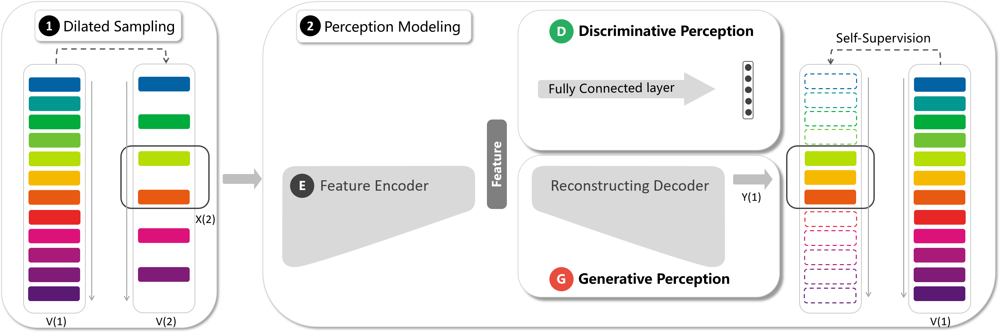

# PRP


### Introduction
This is the implementation of our paper "[Video Playback Rate Perception for Self-supervised Spatio-Temporal Representation Learning](https://arxiv.org/abs/2006.11476)".

### Getting started

 - **Install**
 Our experiments run on Python 3.6.1 and PyTorch 0.4.1. All dependencies can be installed using pip:
	```sh
	python -m pip install -r requirements.txt
	```
 - **Data preparation**
 We construct experiments on [UCF101](https://www.crcv.ucf.edu/data/UCF101.php) and [HMDB51](https://serre-lab.clps.brown.edu/resource/hmdb-a-large-human-motion-database/#Downloads) (the split1 of UCF101 for pre-training and the rest for fine-tuning). The expected dataset directory hierarchy is as follow:
	 ```
	├── UCF101/HMDB51
	│   ├── split
	│   │   ├── classInd.txt
	│   │   ├── testlist01.txt
	│   │   ├── trainlist01.txt
	│   │   └── ...
	│   └── video
	│       ├── ApplyEyeMakeup
	│       │   └── *.avi
	│       └── ...
	└── ...
	```
 - **Train and Test**
 **Pre-training on Pretext Task**
 	```sh
	python train_predict.py --gpu 0 --epoch 300 --model_name c3d/r21d/r3d
	```
	**Action Recognition**
 	```sh
	python ft_classfy.py --gpu 0 --model_name c3d/r21d/r3d --pre_path [your pre-trained model] --split 1/2/3
	python test_classify.py
	```
	**Video Retrieval**
	Please refer to the code [video_retrieval_samples.py]([https://github.com/xudejing/video-clip-order-prediction/blob/master/video_retrieval_samples.py](https://github.com/xudejing/video-clip-order-prediction/blob/master/video_retrieval_samples.py)) of [VCOP]([https://openaccess.thecvf.com/content_CVPR_2019/papers/Xu_Self-Supervised_Spatiotemporal_Learning_via_Video_Clip_Order_Prediction_CVPR_2019_paper.pdf](https://openaccess.thecvf.com/content_CVPR_2019/papers/Xu_Self-Supervised_Spatiotemporal_Learning_via_Video_Clip_Order_Prediction_CVPR_2019_paper.pdf)).
	
### Model zoo
 - **Models**
Pre-trained PRP model on the split1 of UCF101: C3D[*(OneDrive)*](https://1drv.ms/u/s!Al-IKnCwKkpqilawzdPyCbeVVjD_?e=4OycfF); R3D[*(OneDrive)*](https://1drv.ms/u/s!Al-IKnCwKkpqilocEjNpxrLY326F?e=W9LI8y); R(2+1)D[*(OneDrive)*](https://1drv.ms/u/s!Al-IKnCwKkpqiljBkCPn0nALy1H4?e=dSdnAd)
 - **Action Recognition Results**
	|   Architecture             |UCF101(%)                          |HMDB51(%)                        |
	|----------------|-------------------------------|-----------------------------|
	|C3D				|69.1            						  |34.5           |
	|R3D          		|66.5            						  |29.7            |
	| R(2+1)D        |72.1									  |35.0|
### License
This project is released under the [Apache 2.0 license](LICENSE).
### Citation
Please cite the following paper if you feel RSPNet useful to your research
```
@InProceedings{Yao_2020_CVPR,  
author = {Yao, Yuan and Liu, Chang and Luo, Dezhao and Zhou, Yu and Ye, Qixiang},  
title = {Video Playback Rate Perception for Self-Supervised Spatio-Temporal Representation Learning},  
booktitle = {Proceedings of the IEEE/CVF Conference on Computer Vision and Pattern Recognition (CVPR)},  
month = {June},  
year = {2020}  
}
```

